# Gabriel Rance

### AI Engineer building production systems at the intersection of
### LLM infrastructure, product, and real users.

**OpenAI Hackathon Finalist**

[Portfolio](https://iamgabriel.xyz) ·
[LinkedIn](https://linkedin.com/in/gabriel-rance-ensam) ·
[Email](mailto:gabriel.rance@ensam.eu)

---

## At a glance

| 86k+ | 1,000+ | Finalist |
|:---:|:---:|:---:|
| production queries studied | users reached at Wonka | OpenAI Hackathon |
| LLM routing research | shipped AI products | built under pressure |

## In production

### Wonka AI

**Customer-facing AI products and integrations used by 1,000+ people.**

I work across product, engineering, and deployment: building integrations,
agent infrastructure, and features shaped directly by customer workflows.

`TypeScript` · `Python` · `MCP` · `LLM infrastructure`

## Selected work

### Agent Call

**A self-hosted voice-agent appliance for outbound sales teams.**

Sales reps manage fleets of AI callers that qualify leads, update the CRM,
and improve from each campaign. Every operator owns their SIP trunk, models,
data, and costs instead of depending on a shared calling platform.

`Bun` · `React` · `MCP` · `Pipecat` · `LiveKit SIP` · `Postgres`

### [QueryRouter++](https://github.com/Caezarr/queryrouter-plus-plus)

**Multi-objective routing for production LLM systems.**

Routes each query according to performance, cost, latency, and environmental
impact instead of relying on a single default model.

Developed from my ENSAM engineering thesis and validated against
**86k+ production queries**.

`Python` · `FastAPI` · `LLM evaluation` · `multi-objective optimization`

### [Fredo / Bond-OpenAI](https://github.com/Caezarr/Bond-OpenAI)

**OpenAI Hackathon finalist — safe phone actions for software agents.**

A local MCP lets Codex and other compatible agents turn a task into a real,
consented phone call. Classification, preview, confirmation, strict allowlists,
and structured results are part of the action contract.

`Python` · `MCP` · `Twilio` · `Deepgram Voice Agent`

## More builds

| Project | What it explores |
|---|---|
| **[Mirror](https://caezarr.github.io/mirror-site/)** | Local-first macOS workflow assistant that recognizes repeated work and prepares reviewable automation drafts without collecting screenshots, keystrokes, or page content. |
| **[Boring · `Chiant`](https://github.com/Caezarr/Chiant)** | Computer-vision parking assistant combining control-vehicle detection, geofencing, and programmatic parking payment. |
| **[MCP integrations](https://github.com/Caezarr/bowimi-mcp)** | Connectors for Bowimi, Odoo, and other business software so agents can safely act inside operational workflows. |
| **[Gauntlet](https://github.com/Caezarr/gauntlet)** | Parallel AI-agent harness for evidence-backed QA, code review, security audits, and implementation loops. |
| **[Forge](https://github.com/Caezarr/forge)** | Local-first Life OS for morning execution, habits, training, focus, and personal progression. |
| **[Career OS](https://github.com/Caezarr/career-ops)** | Native Mac workspace for application tracking, CV tailoring, interview preparation, and a live copilot. |

See the full portfolio at **[iamgabriel.xyz](https://iamgabriel.xyz)**.

## What I care about

- LLM routing and evaluation;
- agent infrastructure that remains observable in production;
- integrations grounded in real operational workflows;
- working directly with users to turn vague needs into deployed systems.

## Current direction

Growing toward **Forward Deployed Engineering**: deep enough in the stack to
build the system, close enough to users to know which system should be built.
